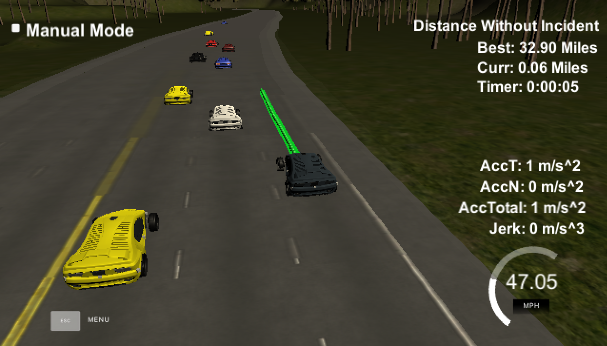

# CarND-Path-Planning-Project
Self-Driving Car Engineer Nanodegree Program

## Goals
In this project your goal is to safely navigate around a virtual highway with other traffic that is driving +-10 MPH of the 50 MPH speed limit. You will be provided the car's localization and sensor fusion data, there is also a sparse map list of way points around the highway. The car should try to go as close as possible to the 50 MPH speed limit, which means passing slower traffic when possible, note that other cars will try to change lanes too. The car should avoid hitting other cars at all cost as well as driving inside of the marked road lanes at all times, unless going from one lane to another. The car should be able to make one complete loop around the 6946m highway. Since the car is trying to go 50 MPH, it should take a little over 5 minutes to complete 1 loop. Also the car should not experience total acceleration over 10 m/s^2 and jerk that is greater than 10 m/s^3.

## Vehicle State Machine

At any given moment the vehicle is in one of 3 states: Lane following, Change Lane Right, Change Lane Left.

In the lane following state, a 50-point path is generated just in front of the vehicle directly hugging the centre of the current lane.

In a lane change state, a path of 200 points is generated to guide the vehicle into a new lane, no new points are generated until the vehicle executed most of the points and arrives in a new lane.

## State Transition Function

Normally the vehicle is in lane following state. If it sees there is a car in front of it, it will slow down to match the speed of the leading vehicle. If the speed is too slow, it will start to evaluate options to change lanes.

The vehicle first looks at all moving objects detected by sensor fusion in the adjacent lanes. Project all their locations 3s into the future using the object's speed. If any of the object comes within 15m of our eagle vehicle, then we say that lane is blocked.

If the lane is not blocked, then look at two things.
1. What is the speed of the leading vehicle in each candidate lane, is it larger than that of the current lane.
1. What is the distance to the leading vehicle in each candidate lane, is it larger than that of the current lane.
If either of these are true, transition to a lane changing state.

In lane changing state, a lane transition path is generated only once and no new points are generated until the vehicle has executed most of the path at which point a transition will occur back to lane following state.

### Generate drivable paths

Requirement:
- not experience total acceleration over 10 m/s^2
- not exceed jerk that is greater than 10 m/s^3
- drive under the 50 MPH speed limit

The shape of path is generated using a spline given a few Anchor points along the intended path. The anchor points consists of last 3 points from the previous path to provide continuity and 3 future waypoints 30m apart in front of the last points of the previous path. If our car is in lane-following state then the future points would be in the current lane, otherwise they will be in the intended lane.

The spline is sampled to generate way points for the vehicle. The way points spacing is proportional to the speed of the vehicle. The speed of the vehicle is not controlled directly. In order to ensure continuity of speed and acceleration, only the jerk of the vehicle is controlled and the acceleration/speed calculated from the jerk. The control of the jerk is very simple. Set jerk to max if the speed is less than target speed and set jerk to min if the speed is more than target speed. This inevitably leads to some over-shoot, hence the target speed of the vehicle is set conservatively to avoid speeding.

The spline is generated in vehicle coordinates so that increasing x is always in the car's heading. A numeric method is used to find the exact x that will give the desired progress in the s coordinates.

# Result

The car is able to drive without incident around the course at reasonable speed changing lanes when appropriate.

This [video](https://youtu.be/qRVVr0W2m6c) shows the vehicle completing a course of more than 4.4 miles without incident. Note the video is sped up. In on of the runs, the vehicle totalled more than 30 miles without incident.
